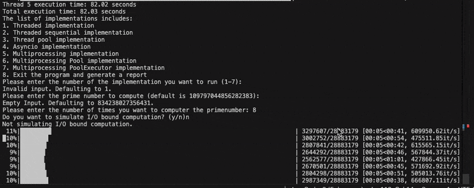
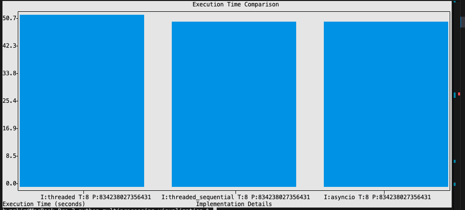
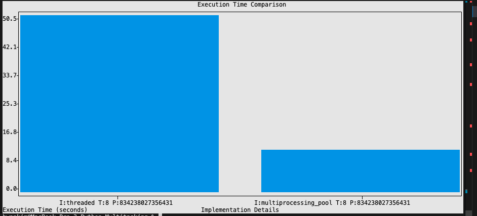
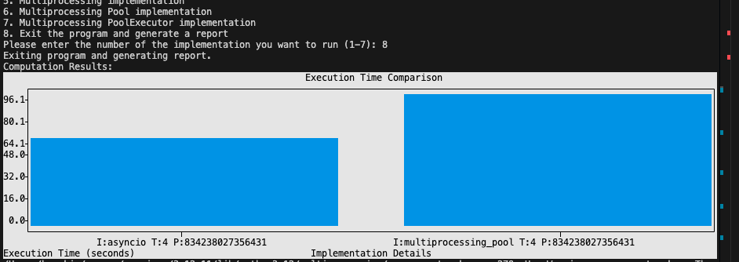

# python_multiprocessing_visualization

This repository contains a command-line tool that visualizes performance differences across various concurrency and parallelism approaches in Python. It compares concurrent vs. parallel execution and evaluates different libraries used in each approach.

📖 [Read the detailed Medium article about this project](https://medium.com/@hwankim2k/comparing-approaches-for-processing-in-python-6926365ca8b9)

---

## 💡 Supported Implementations

Upon running the CLI tool, you can select from the following implementations:

1. Threaded  
2. Sequential  
3. ThreadPool  
4. Asyncio  
5. Multiprocessing  
6. Multiprocessing Pool  
7. Multiprocessing ProcessPoolExecutor  
8. Generate Bar Graph  

---

## 🛠 Usage

After choosing the implementation, you’ll be prompted to:

- Enter the prime number you want to test  
- Choose how many times to run this test (to simulate more or less CPU intensity)  
- Provide the pool size, if applicable  
- Indicate whether to simulate non-blocking I/O-bound behavior (adds artificial delays to mimic I/O waits)  

After the simulation completes, you can generate a bar graph comparing the execution times across implementations.

---

## 📚 Key Learnings

  
**1.** ⚠️ Threaded, Sequential, and Asyncio implementations perform similarly on CPU-bound tasks because they are all limited by Python’s Global Interpreter Lock (GIL).

  
**2.** 🚀 Multiprocessing significantly outperforms other methods for CPU-bound tasks. It uses separate processes, each with its own Python interpreter and memory space, allowing true parallel execution on multiple cores.

  
**3.** ⚡ For non-blocking I/O-bound tasks, Asyncio can be more efficient than multiprocessing. While multiprocessing waits for I/O in each process, Asyncio can switch between coroutines during non-blocking I/O wait times, enabling better resource utilization.